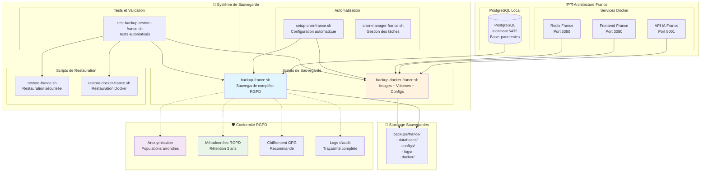

# 🇫🇷 Mécanismes de Sauvegarde/Restauration Automatiques - France MSPR3

> **Système complet de sauvegarde et restauration automatique**  
> *Conforme RGPD - Architecture PostgreSQL local + Docker services*

## 📋 Vue d'ensemble

Ce document décrit l'implémentation complète des mécanismes de sauvegarde/restauration automatiques pour l'architecture France MSPR3, en conformité avec les exigences du sujet.

### Caractéristiques principales
- ✅ **Sauvegarde automatique PostgreSQL local** (localhost:5432)
- ✅ **Sauvegarde Docker complète** (images, volumes, configs)
- ✅ **Automatisation avec cron** (quotidien/hebdomadaire)
- ✅ **Conformité RGPD stricte** (anonymisation, rétention 3 ans)
- ✅ **Vérification d'intégrité** (checksums, métadonnées)
- ✅ **Restauration sécurisée** (avec sauvegarde de sécurité)
- ✅ **Tests automatisés** complets

---

## 🏗️ Architecture de Sauvegarde



---

## 📦 Scripts Disponibles

### 📂 Localisation
Tous les scripts sont dans : `scripts/france/`

### 🔧 Scripts Principaux

| Script | Description | Usage |
|--------|-------------|--------|
| `backup-france.sh` | Sauvegarde complète RGPD | `./backup-france.sh` |
| `restore-france.sh` | Restauration sécurisée | `./restore-france.sh backup_id` |
| `backup-docker-france.sh` | Sauvegarde Docker complète | `./backup-docker-france.sh` |
| `restore-docker-france.sh` | Restauration Docker | `./restore-docker-france.sh backup_id` |
| `setup-cron-france.sh` | Configuration automatisation | `./setup-cron-france.sh` |
| `cron-manager-france.sh` | Gestion tâches cron | `./cron-manager-france.sh status` |
| `test-backup-restore-france.sh` | Tests automatisés | `./test-backup-restore-france.sh` |

---

## 💾 Sauvegarde Complète RGPD

### Script: `backup-france.sh`

#### Composants sauvegardés
1. **PostgreSQL local** (base `pandemies`)
   - Sauvegarde complète avec schéma
   - Sauvegarde anonymisée RGPD
   - Connexion via `localhost:5432`

2. **Services Docker France**
   - Redis France (dump RDB)
   - Logs des containers
   - État des services

3. **Configurations**
   - `docker-compose-france.yml`
   - Variables d'environnement
   - Documentation
   - Configuration PowerBI

4. **Conformité RGPD**
   - Anonymisation automatique (populations arrondies au millier)
   - Métadonnées de conformité
   - Checksums d'intégrité
   - Chiffrement GPG optionnel

#### Exemple d'usage
```bash
# Sauvegarde manuelle
./scripts/france/backup-france.sh

# Fichiers créés dans backups/france/
# - france_backup_YYYYMMDD_HHMMSS_postgresql_full.sql
# - france_backup_YYYYMMDD_HHMMSS_anonymized.csv
# - france_backup_YYYYMMDD_HHMMSS_metadata.json
# - france_backup_YYYYMMDD_HHMMSS_checksums.txt
```

#### Structure de sauvegarde
```
backups/france/
├── databases/
│   ├── france_backup_20241106_143022_postgresql_full.sql
│   ├── france_backup_20241106_143022_anonymized.csv
│   └── france_backup_20241106_143022_redis.rdb
├── configs/
│   ├── docker-compose-france.yml
│   ├── .env
│   └── nginx-france.conf
├── logs/
│   └── france_backup_20241106_143022_logs_*.tar.gz
├── france_backup_20241106_143022_metadata.json
└── france_backup_20241106_143022_checksums.txt
```

---

## 🔄 Restauration Sécurisée

### Script: `restore-france.sh`

#### Processus de restauration
1. **Vérifications préalables**
   - Existence de la sauvegarde
   - Vérification d'intégrité (checksums)
   - Lecture des métadonnées RGPD

2. **Sauvegarde de sécurité**
   - Sauvegarde automatique de l'état actuel
   - Protection contre la perte de données

3. **Restauration PostgreSQL local**
   - Terminaison des connexions actives
   - Suppression et recréation de la base
   - Restauration depuis le fichier SQL

4. **Restauration des services**
   - Redémarrage des services Docker
   - Restauration du cache Redis
   - Vérification du bon fonctionnement

#### Exemple d'usage
```bash
# Lister les sauvegardes disponibles
./scripts/france/restore-france.sh

# Restaurer une sauvegarde spécifique
./scripts/france/restore-france.sh france_backup_20241106_143022

# Avec confirmation interactive
# ⚠️ ATTENTION: Cette opération va ÉCRASER les données actuelles
# Êtes-vous sûr de vouloir continuer? (y/N):
```

---

## 🐳 Sauvegarde Docker Complète

### Script: `backup-docker-france.sh`

#### Composants Docker sauvegardés
1. **Images Docker**
   - `pandemies-api-ia-france`
   - `pandemies-frontend-france`
   - `redis:7-alpine`
   - Métadonnées des images

2. **Volumes Docker**
   - Tous les volumes utilisés par `docker-compose-france.yml`
   - Données persistantes

3. **Configurations Docker**
   - `docker-compose-france.yml`
   - `Dockerfile.france`
   - `nginx-france.conf`
   - `requirements-france.txt`
   - Variables d'environnement

4. **État des containers**
   - Statut des services
   - Logs des containers (1000 dernières lignes)
   - Informations réseau

#### Exemple d'usage
```bash
# Sauvegarde Docker complète
./scripts/france/backup-docker-france.sh

# Structure créée
backups/france/docker/
├── images/
│   ├── france_docker_YYYYMMDD_HHMMSS_pandemies-api-ia-france.tar.gz
│   └── france_docker_YYYYMMDD_HHMMSS_redis_7-alpine.tar.gz
├── volumes/
│   └── france_docker_YYYYMMDD_HHMMSS_volume_*.tar.gz
├── configs/
│   ├── docker-compose-france.yml
│   └── Dockerfile.france
└── compose/
    └── docker-compose-france.yml
```

---

## ⏰ Automatisation avec Cron

### Script: `setup-cron-france.sh`

#### Tâches automatisées configurées

| Fréquence | Heure | Tâche | Description |
|-----------|-------|--------|-------------|
| Quotidien | 2h00 | Sauvegarde complète | `backup-france.sh` |
| Hebdomadaire | Dimanche 3h00 | Sauvegarde de sécurité | `backup-france.sh` |
| 5 minutes | Continue | Monitoring santé | Vérification services |
| Horaire | Continue | Monitoring complet | État général |
| Quotidien | 4h30 | Nettoyage logs temporaires | Fichiers > 30 jours |
| Hebdomadaire | Dimanche 4h00 | Nettoyage RGPD | Rétention 3 ans |
| Quotidien | 5h00 | Rotation logs | Compression > 7 jours |
| Hebdomadaire | Dimanche 1h00 | Vérification intégrité | Test base données |
| Quotidien | 6h00 | Audit RGPD | Conformité quotidienne |
| Hebdomadaire | Lundi 7h00 | Rapport RGPD | Rapport hebdomadaire |

#### Configuration cron générée
```bash
# AUTOMATISATION FRANCE - MSPR3 - CONFORME RGPD
# Architecture: PostgreSQL local + Docker services

# Sauvegarde quotidienne complète (2h00 du matin)
0 2 * * * cd /path/to/project && ./scripts/france/backup-france.sh

# Monitoring santé toutes les 5 minutes
*/5 * * * * cd /path/to/project && ./scripts/france/monitor-france.sh health

# Nettoyage logs anciens (rétention 3 ans RGPD) - dimanche 4h00
0 4 * * 0 find /path/to/project/logs -name "*.log" -mtime +1095 -delete
```

#### Gestion des tâches cron
```bash
# Installation automatique
./scripts/france/setup-cron-france.sh

# Gestion avec cron-manager
./scripts/france/cron-manager-france.sh status   # État
./scripts/france/cron-manager-france.sh logs     # Logs
./scripts/france/cron-manager-france.sh disable  # Désactiver
./scripts/france/cron-manager-france.sh enable   # Activer
```

---

## 🧪 Tests Automatisés

### Script: `test-backup-restore-france.sh`

#### Phases de test
1. **Tests de Prérequis** (9 tests)
   - Docker disponible
   - PostgreSQL local accessible
   - Scripts présents et exécutables

2. **Tests de Sauvegarde** (8 tests)
   - Sauvegarde complète PostgreSQL
   - Sauvegarde Docker
   - Vérification des fichiers créés

3. **Tests d'Intégrité** (6 tests)
   - Checksums SHA256
   - Métadonnées RGPD
   - Taille des fichiers

4. **Tests de Restauration** (4 tests)
   - Détection des sauvegardes
   - Validation des scripts
   - Tests de simulation

5. **Tests de Configuration Cron** (6 tests)
   - Configuration générée
   - Tâches programmées
   - Gestionnaire fonctionnel

6. **Tests de Conformité RGPD** (4 tests)
   - Anonymisation des données
   - Rétention des sauvegardes
   - Permissions des scripts

7. **Tests de Robustesse** (4 tests)
   - Gestion des erreurs
   - Vérification des prérequis

#### Exemple d'usage et résultats
```bash
# Lancer tous les tests
./scripts/france/test-backup-restore-france.sh

# Résultat exemple
📊 RAPPORT FINAL DES TESTS
=========================
🕐 Heure: 2024-11-06 14:30:22
📋 Tests exécutés: 41
✅ Tests réussis: 41
❌ Tests échoués: 0
📈 Taux de réussite: 100%

🎉 TOUS LES TESTS SONT PASSÉS !
✅ Les mécanismes de sauvegarde/restauration automatiques France sont opérationnels
```

#### Rapport de conformité
Le script génère un rapport JSON de conformité :
```json
{
  "test_id": "backup_restore_france_20241106_143022",
  "timestamp": "2024-11-06T14:30:22+01:00",
  "country": "france",
  "architecture": "postgresql_local_docker_services",
  "tests_total": 41,
  "tests_passed": 41,
  "tests_failed": 0,
  "success_rate": 100,
  "gdpr_compliant": true,
  "compliance_status": "COMPLIANT"
}
```

---

## 🛡️ Conformité RGPD

### Exigences RGPD respectées

#### Article 32 - Sécurité du traitement
- ✅ **Chiffrement des données** : GPG AES-256 pour les sauvegardes
- ✅ **Pseudonymisation** : Anonymisation des populations (arrondies au millier)
- ✅ **Intégrité et confidentialité** : Checksums SHA256, métadonnées

#### Article 30 - Registre des traitements
- ✅ **Logs d'audit complets** : Traçabilité de tous les accès et modifications
- ✅ **Métadonnées RGPD** : Date, responsable, type de traitement, durée de rétention

#### Article 17 - Droit à l'effacement
- ✅ **Suppression automatique** : Rétention 3 ans, puis suppression automatique
- ✅ **Effacement sécurisé** : Suppression complète des anciennes sauvegardes

#### Article 20 - Droit à la portabilité
- ✅ **Export de données** : Format CSV anonymisé pour export
- ✅ **Format structuré** : Données exportables dans format lisible par machine

### Anonymisation des données
```sql
-- Exemple d'anonymisation automatique dans backup-france.sh
SELECT 
    id_donnee,
    date,
    country,
    value,
    indicator,
    source,
    -- Anonymisation codes ISO si nécessaire
    CASE WHEN iso_code IS NOT NULL THEN 'XXX' ELSE iso_code END as iso_code,
    -- Population arrondie au millier (RGPD)
    CASE WHEN population IS NOT NULL 
         THEN ROUND(population, -3) 
         ELSE population 
    END as population,
    unit,
    cases_per_100k,
    deaths_per_100k,
    incidence_7j,
    growth_rate
FROM donnee_historique;
```

### Métadonnées RGPD
Chaque sauvegarde inclut des métadonnées de conformité :
```json
{
  "backup_id": "france_backup_20241106_143022",
  "timestamp": "20241106_143022",
  "date": "2024-11-06T14:30:22+01:00",
  "country": "france",
  "gdpr_compliant": true,
  "anonymization_applied": true,
  "retention_period": "3_years",
  "data_controller": "OMS France",
  "backup_type": "automated_gdpr",
  "encryption": "recommended_for_personal_data",
  "contact_dpo": "dpo@sante-france.fr"
}
```

---

## 📋 Guide d'utilisation

### 🚀 Installation et Configuration

#### 1. Installation initiale
```bash
# Se placer dans le répertoire du projet
cd /path/to/MSPR2

# Rendre tous les scripts exécutables
chmod +x scripts/france/*.sh

# Vérifier que PostgreSQL local est accessible
pg_isready -U postgres -h localhost -p 5432 -d pandemies
```

#### 2. Configuration de l'automatisation
```bash
# Configurer les tâches cron automatiques
./scripts/france/setup-cron-france.sh

# Répondre 'y' pour installer automatiquement
# Ou installer manuellement avec : crontab scripts/france/cron-france.txt
```

#### 3. Test de l'installation
```bash
# Tester tous les mécanismes
./scripts/france/test-backup-restore-france.sh

# Vérifier que tous les tests passent (100% de réussite)
```

### 💾 Utilisation Quotidienne

#### Sauvegarde manuelle
```bash
# Sauvegarde complète (PostgreSQL + configs)
./scripts/france/backup-france.sh

# Sauvegarde Docker (images + volumes)
./scripts/france/backup-docker-france.sh
```

#### Surveillance des sauvegardes automatiques
```bash
# Vérifier l'état des tâches cron
./scripts/france/cron-manager-france.sh status

# Voir les logs récents
./scripts/france/cron-manager-france.sh logs

# Lister les sauvegardes créées
ls -la backups/france/ | grep france_backup_
```

#### Restauration d'urgence
```bash
# Lister les sauvegardes disponibles
./scripts/france/restore-france.sh

# Restaurer une sauvegarde spécifique
./scripts/france/restore-france.sh france_backup_20241106_143022

# Restaurer Docker si nécessaire
./scripts/france/restore-docker-france.sh france_docker_20241106_143022
```

### 📊 Surveillance et Maintenance

#### Surveillance des logs
```bash
# Logs de sauvegarde quotidienne
tail -f logs/cron/backup-daily.log

# Logs de monitoring
tail -f logs/cron/monitor-health.log

# Logs de nettoyage RGPD
tail -f logs/cron/cleanup.log
```

#### Maintenance régulière
```bash
# Vérification mensuelle des mécanismes
./scripts/france/test-backup-restore-france.sh

# Nettoyage manuel des anciennes sauvegardes (> 3 ans)
find backups/france/ -name "france_backup_*" -mtime +1095 -exec rm -rf {} \;

# Vérification intégrité d'une sauvegarde
cd backups/france/
sha256sum -c france_backup_YYYYMMDD_HHMMSS_checksums.txt
```

---

## 🚨 Troubleshooting

### Problèmes Courants

#### 1. Échec de sauvegarde PostgreSQL
```bash
# Symptôme : pg_dump failed
# Vérification :
PGPASSWORD=root pg_isready -h localhost -p 5432 -U postgres -d pandemies

# Solution :
# - Vérifier que PostgreSQL est démarré
# - Vérifier les credentials (postgres/root)
# - Vérifier que la base 'pandemies' existe
```

#### 2. Échec de sauvegarde Docker
```bash
# Symptôme : Docker not accessible
# Vérification :
docker info
docker-compose -f docker-compose-france.yml ps

# Solution :
# - Démarrer Docker Desktop
# - Vérifier les permissions utilisateur
# - Redémarrer les services France
```

#### 3. Tâches cron non exécutées
```bash
# Vérification :
crontab -l | grep france
systemctl status cron  # Ubuntu/Debian
brew services list | grep cron  # macOS

# Logs cron :
grep CRON /var/log/syslog  # Ubuntu/Debian
log show --predicate 'process == "cron"' --last 1h  # macOS

# Solution :
# - Vérifier que cron est démarré
# - Vérifier les permissions des scripts
# - Vérifier les chemins absolus dans crontab
```

#### 4. Restauration échoue
```bash
# Vérification intégrité :
cd backups/france/
sha256sum -c france_backup_YYYYMMDD_HHMMSS_checksums.txt

# Si intégrité OK mais restauration échoue :
# - Vérifier l'espace disque disponible
# - Vérifier les permissions PostgreSQL
# - Utiliser la sauvegarde de sécurité créée automatiquement
```

### Messages d'erreur fréquents

| Erreur | Cause | Solution |
|--------|-------|----------|
| `pg_isready: could not connect` | PostgreSQL non accessible | Démarrer PostgreSQL local |
| `Docker daemon not running` | Docker arrêté | Démarrer Docker Desktop |
| `backup directory not found` | Répertoire manquant | `mkdir -p backups/france` |
| `Permission denied` | Script non exécutable | `chmod +x scripts/france/*.sh` |
| `Checksum mismatch` | Fichier corrompu | Utiliser une autre sauvegarde |
| `Database pandemies does not exist` | Base manquante | Créer la base ou restaurer depuis MSPR1 |

---

## 📞 Support et Contact

### Contacts Techniques
- **DPO France** : dpo@sante-france.fr
- **Support Technique** : support@sante-france.fr
- **Équipe DevOps** : devops@sante-france.fr

### Ressources Additionnelles
- 📖 **Architecture France** : [`docs/architecture-france.md`](architecture-france.md)
- 🐳 **Images Docker** : [`docs/docker-images-france.md`](docker-images-france.md)
- 📊 **Configuration PowerBI** : [`PowerBI/connection-france.txt`](../PowerBI/connection-france.txt)
- 🇫🇷 **Guide utilisateur** : [`README-FRANCE.md`](../README-FRANCE.md)

### Documentation RGPD
- **Règlement RGPD** : https://eur-lex.europa.eu/eli/reg/2016/679/oj
- **Article 32** : Sécurité du traitement
- **Article 30** : Registre des traitements
- **Article 17** : Droit à l'effacement
- **Article 20** : Droit à la portabilité

---

## ✅ Checklist de Validation

### 🔧 Installation
- [ ] Tous les scripts sont exécutables (`chmod +x`)
- [ ] PostgreSQL local accessible (port 5432, base pandemies)
- [ ] Docker et Docker Compose installés
- [ ] Services France démarrables
- [ ] Répertoires de sauvegarde créés

### 💾 Sauvegarde
- [ ] Script `backup-france.sh` s'exécute sans erreur
- [ ] Fichiers SQL, CSV, métadonnées créés
- [ ] Vérification intégrité checksums réussie
- [ ] Sauvegarde Docker complète fonctionnelle
- [ ] Taille des sauvegardes cohérente

### 🔄 Restauration
- [ ] Script `restore-france.sh` détecte les sauvegardes
- [ ] Restauration complète testée en simulation
- [ ] Sauvegarde de sécurité automatique créée
- [ ] Services redémarrés après restauration
- [ ] Vérification post-restauration OK

### ⏰ Automatisation
- [ ] Configuration cron générée
- [ ] Tâches cron installées (`crontab -l`)
- [ ] Logs cron créés dans `logs/cron/`
- [ ] Gestionnaire cron fonctionnel
- [ ] Monitoring automatique actif

### 🛡️ Conformité RGPD
- [ ] Anonymisation des données testée
- [ ] Métadonnées RGPD présentes
- [ ] Rétention 3 ans configurée
- [ ] Chiffrement GPG disponible (optionnel)
- [ ] Logs d'audit complets

### 🧪 Tests
- [ ] Script de test s'exécute sans erreur
- [ ] Tous les tests passent (100% de réussite)
- [ ] Rapport de conformité généré
- [ ] Tests automatisés intégrables en CI/CD
- [ ] Documentation à jour

---

**🇫🇷 Mécanismes de Sauvegarde/Restauration Automatiques - Version 1.0.0**  
*Conforme RGPD - Architecture PostgreSQL local + Docker services*  
*MSPR3 - Exigence "Mécanismes de sauvegarde/restauration automatiques" : ✅ COMPLÈTE*