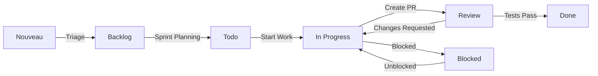

# Configuration GitHub Projects - Guide Pratique

## 🚀 Configuration Initiale GitHub Projects

### 1️⃣ Création du Projet

1. **Accéder à GitHub Projects**
   ```
   https://github.com/users/[VOTRE_USERNAME]/projects
   ou
   https://github.com/orgs/[VOTRE_ORG]/projects
   ```

2. **Créer un nouveau projet**
   - Cliquer sur "New project"
   - Nom : `MSPR2 - Projet IA OMS`
   - Description : `Gestion de projet pour solution IA multi-pays OMS`
   - Visibilité : **Private** (équipe de 5)

3. **Choisir le template**
   - Sélectionner : **"Team backlog"**
   - Ou partir de **"Blank"** pour personnalisation complète

---

## 📋 2️⃣ Configuration des Vues

### **Vue 1 : Kanban Board (Principal)**
```
Configuration > Views > Board

Colonnes:
📋 Backlog → ⏳ Todo → 🔄 In Progress → 👀 Review → ✅ Done

Grouping: Par Status
Sorting: Par Priority (High → Low)
Filtering: [Configurable par sprint]
```

### **Vue 2 : Table View (Détaillée)**
```
Configuration > Views > Table

Colonnes visibles:
- Title
- Assignee  
- Status
- Priority
- Labels
- Sprint
- Estimate
- Country (custom field)
```

### **Vue 3 : Roadmap (Timeline)**
```
Configuration > Views > Roadmap

Timeline: Par Sprint (2 semaines)
Grouping: Par composant (AI, API, Frontend, etc.)
Date field: Sprint dates
```

---

## 🏷️ 3️⃣ Configuration des Champs Personnalisés

### **Champ : Priority**
```
Type: Single select
Options:
🔴 High
🟡 Medium  
🟢 Low
```

### **Champ : Sprint**
```
Type: Single select
Options:
Sprint 1 (Semaines 1-2)
Sprint 2 (Semaines 3-4)
Sprint 3 (Semaines 5-6)
Sprint 4 (Semaines 7-8)
Backlog
```

### **Champ : Estimate**
```
Type: Number
Unit: Hours
Range: 0.5 - 40
```

### **Champ : Component**
```
Type: Single select
Options:
🤖 AI/ML
🗄️ Backend API
🎨 Frontend
📊 Data/ETL
🧪 Testing
📚 Documentation
🚀 DevOps
```

### **Champ : Country**
```
Type: Multi-select
Options:
🇺🇸 United States
🇫🇷 France
🇨🇭 Switzerland
🌍 Global
```

---

## 🤖 4️⃣ Automatisations GitHub

### **Workflow 1 : Auto-assign to Project**
```yaml
# .github/workflows/add-to-project.yml
name: Add Issues to Project

on:
  issues:
    types: [opened]
  pull_request:
    types: [opened]

jobs:
  add-to-project:
    name: Add issue to project
    runs-on: ubuntu-latest
    steps:
      - uses: actions/add-to-project@v0.4.0
        with:
          project-url: https://github.com/users/[USERNAME]/projects/[PROJECT_NUMBER]
          github-token: ${{ secrets.ADD_TO_PROJECT_PAT }}
```

### **Workflow 2 : Auto-move Cards**
```yaml
# .github/workflows/project-automation.yml
name: Project Board Automation

on:
  pull_request:
    types: [opened, closed, reopened]
  issues:
    types: [opened, closed, assigned]

jobs:
  update-project:
    runs-on: ubuntu-latest
    steps:
      - name: Move to In Progress when PR opened
        if: github.event.action == 'opened' && github.event.pull_request
        uses: alex-page/github-project-automation-plus@v0.8.3
        with:
          project: MSPR2 - Projet IA OMS
          column: In Progress
          repo-token: ${{ secrets.GITHUB_TOKEN }}
          
      - name: Move to Review when PR ready
        if: github.event.pull_request.draft == false
        uses: alex-page/github-project-automation-plus@v0.8.3
        with:
          project: MSPR2 - Projet IA OMS
          column: Review
          repo-token: ${{ secrets.GITHUB_TOKEN }}
          
      - name: Move to Done when merged
        if: github.event.pull_request.merged == true
        uses: alex-page/github-project-automation-plus@v0.8.3
        with:
          project: MSPR2 - Projet IA OMS
          column: Done
          repo-token: ${{ secrets.GITHUB_TOKEN }}
```

---

## 📝 5️⃣ Templates d'Issues

### **Template : User Story**
```markdown
<!-- .github/ISSUE_TEMPLATE/user-story.md -->
---
name: User Story
about: Nouvelle fonctionnalité utilisateur
title: '[USER STORY] '
labels: 'feature, needs-estimation'
assignees: ''
---

## 👤 En tant que
[Type d'utilisateur]

## 🎯 Je veux
[Fonctionnalité souhaitée]

## ✅ Afin de
[Valeur métier / objectif]

## 📋 Critères d'Acceptation
- [ ] Critère 1
- [ ] Critère 2
- [ ] Critère 3

## 🧪 Scénarios de Test
- [ ] Test 1
- [ ] Test 2

## 📊 Estimation
- Complexité: [Low/Medium/High]
- Effort: [X heures]

## 🏷️ Labels
- Priority: [High/Medium/Low]
- Component: [AI/Backend/Frontend/Data/DevOps]
- Sprint: [Sprint X ou Backlog]
- Country: [US/France/Switzerland/Global]
```

### **Template : Bug Report**
```markdown
<!-- .github/ISSUE_TEMPLATE/bug-report.md -->
---
name: Bug Report
about: Signaler un problème
title: '[BUG] '
labels: 'bug, needs-triage'
assignees: ''
---

## 🐛 Description du Bug
Description claire et concise du problème

## 🔄 Étapes pour Reproduire
1. Aller à '...'
2. Cliquer sur '...'
3. Voir l'erreur

## ✅ Comportement Attendu
Description de ce qui devrait se passer

## 📱 Environnement
- OS: [Windows/Linux/Mac]
- Browser: [Chrome/Firefox/Safari]
- Version: [version du projet]

## 📊 Impact
- Criticité: [Critical/High/Medium/Low]
- Composant: [AI/Backend/Frontend/Data]

## 📎 Screenshots/Logs
[Si applicable, ajouter captures d'écran ou logs]
```

### **Template : Technical Task**
```markdown
<!-- .github/ISSUE_TEMPLATE/technical-task.md -->
---
name: Technical Task
about: Tâche technique (refactoring, setup, etc.)
title: '[TECH] '
labels: 'technical, needs-estimation'
assignees: ''
---

## 🔧 Description Technique
Description de la tâche technique à réaliser

## 🎯 Objectif
Pourquoi cette tâche est nécessaire

## 📋 Tâches Détaillées
- [ ] Sous-tâche 1
- [ ] Sous-tâche 2
- [ ] Sous-tâche 3

## ✅ Définition de "Terminé"
- [ ] Code implémenté
- [ ] Tests passants
- [ ] Documentation mise à jour
- [ ] Code review fait

## 📊 Estimation
- Effort: [X heures]
- Complexité: [Low/Medium/High]
```

---

## 📊 6️⃣ Métriques et Reporting

### **Script de Vélocité Automatique**
```python
# scripts/project_metrics.py
import requests
import json
from datetime import datetime, timedelta

def get_sprint_velocity():
    """Calcule la vélocité de l'équipe par sprint"""
    # API GitHub Projects v2
    query = """
    query($project_id: ID!) {
        node(id: $project_id) {
            ... on ProjectV2 {
                items(first: 100) {
                    nodes {
                        fieldValues(first: 10) {
                            nodes {
                                ... on ProjectV2ItemFieldSingleSelectValue {
                                    name
                                    field {
                                        ... on ProjectV2FieldCommon {
                                            name
                                        }
                                    }
                                }
                                ... on ProjectV2ItemFieldNumberValue {
                                    number
                                    field {
                                        ... on ProjectV2FieldCommon {
                                            name
                                        }
                                    }
                                }
                            }
                        }
                    }
                }
            }
        }
    }
    """
    
    # Traitement et calcul vélocité
    velocity_data = process_sprint_data(response)
    generate_velocity_chart(velocity_data)

def generate_burndown_chart():
    """Génère un burndown chart pour le sprint actuel"""
    sprint_data = get_current_sprint_data()
    remaining_points = calculate_remaining_work(sprint_data)
    
    chart_config = {
        'type': 'line',
        'data': {
            'labels': ['J1', 'J2', 'J3', 'J4', 'J5', 'J6', 'J7', 'J8', 'J9', 'J10'],
            'datasets': [
                {
                    'label': 'Idéal',
                    'data': calculate_ideal_line(),
                    'borderColor': 'gray',
                    'borderDash': [5, 5]
                },
                {
                    'label': 'Réel',
                    'data': remaining_points,
                    'borderColor': 'blue',
                    'backgroundColor': 'rgba(0,0,255,0.1)'
                }
            ]
        }
    }
    
    save_chart_to_project(chart_config)

if __name__ == "__main__":
    get_sprint_velocity()
    generate_burndown_chart()
```

### **Dashboard Automatisé**
```markdown
## 📊 Dashboard Sprint 2

### Vélocité
- **Planifié** : 35 points
- **Réalisé** : 28 points (80%)
- **Tendance** : ↘️ Légère baisse vs Sprint 1

### Work In Progress
- **En cours** : 4/4 tâches (WIP limit atteint)
- **En review** : 2 tâches
- **Blockers** : 1 tâche bloquée

### Qualité Code
- **Coverage** : 82% (↗️ +4% vs Sprint 1)
- **Bugs ouverts** : 2 (↗️ -1 vs Sprint 1)
- **Technical debt** : 2.5h (stable)

### Satisfaction Équipe
- **Daily attendance** : 98%
- **Sprint goal confidence** : 8.5/10
- **Team mood** : 😊 Positive
```

---

## 🎯 7️⃣ Processus de Workflow

### **Cycle de Vie d'une Issue**



### **Règles d'Attribution**

1. **Auto-assignment**
   - Issues avec label `bug` → assignées au créateur
   - PRs → assignées à l'auteur
   - Issues `frontend` → @dev-frontend par défaut

2. **Work In Progress Limits**
   - Max 4 tâches "In Progress" simultanément
   - Max 2 tâches par développeur "In Progress"

3. **Review Process**
   - Minimum 1 reviewer obligatoire
   - Tests automatiques doivent passer
   - Code coverage ne doit pas diminuer

---

## 🔧 8️⃣ Configuration Avancée

### **Intégration Slack (Optionnel)**
```yaml
# .github/workflows/slack-notifications.yml
name: Slack Notifications

on:
  issues:
    types: [opened, closed]
  pull_request:
    types: [opened, merged, closed]

jobs:
  slack:
    runs-on: ubuntu-latest
    steps:
      - name: Slack Notification
        uses: 8398a7/action-slack@v3
        with:
          status: ${{ job.status }}
          channel: '#mspr2-dev'
          webhook_url: ${{ secrets.SLACK_WEBHOOK }}
          fields: repo,message,commit,author,action,eventName,ref,workflow
```

### **Backup Automatique**
```python
# scripts/backup_project.py
def backup_project_data():
    """Sauvegarde quotidienne des données du projet"""
    project_data = export_github_project()
    
    backup_file = f"backups/project_backup_{datetime.now().strftime('%Y%m%d')}.json"
    
    with open(backup_file, 'w') as f:
        json.dump(project_data, f, indent=2)
    
    # Upload vers Google Drive ou autre cloud
    upload_to_cloud(backup_file)

# Cron job quotidien
# 0 2 * * * python scripts/backup_project.py
```

---

## 🚀 9️⃣ Actions Immédiates

### **Checklist de Configuration** ✅

- [ ] Créer le projet GitHub
- [ ] Configurer les vues (Kanban, Table, Roadmap)
- [ ] Ajouter les champs personnalisés
- [ ] Créer les templates d'issues
- [ ] Configurer les automatisations de base
- [ ] Inviter l'équipe (5 membres)
- [ ] Importer les issues existantes
- [ ] Tester le workflow complet
- [ ] Former l'équipe à l'outil
- [ ] Programmer la première Sprint Planning

### **Formation Équipe** (1h)

1. **Tour de l'interface** (15min)
   - Navigation entre vues
   - Création d'issues
   - Attribution et labels

2. **Workflow quotidien** (20min)
   - Mise à jour statuts
   - Utilisation lors des daily standups
   - Gestion des blockers

3. **Sprint ceremonies** (15min)
   - Sprint planning avec le board
   - Review et démo
   - Rétrospective

4. **Questions/réponses** (10min)

Cette configuration vous donnera un système de gestion de projet professionnel, gratuit et parfaitement adapté à votre équipe de 5 personnes ! 🎯

