# Partie 1 – C1 : Générer, récolter et adapter les données (API IA & API Express)

---

## Slide 1 – Génération et collecte des données (C1)

**Compétence visée :** Générer des données d'entrée, récolter et adapter les types de données traitées nécessaires au modèle d’apprentissage.  
**Critère :** Cohérence des approches et outils de préparation, fiabilité des données.

### Contexte
Dans ce projet, l’API IA (FastAPI) ne se connecte pas directement à la base de données ou à l’ETL, mais consomme les données via l’API Express (Node.js). L’API Express centralise l’accès aux données épidémiologiques (COVID-19, MPOX) stockées en base PostgreSQL et expose des endpoints RESTful pour :
- Les historiques de cas et décès
- Les indicateurs agrégés par pays, date, maladie
- Les métadonnées (population, facteurs de risque, etc.)

### Illustration du flux de données
```mermaid
graph TD;
  FE[Frontend] --> IA[API IA (FastAPI)]
  IA --> EX[API Express (Node.js)]
  EX -->|Données JSON| IA
  IA -->|Prédictions| FE
```

### Exemple de requête API IA → API Express
```python
import requests
url = 'http://localhost:3000/api/donnees-historiques?country=France&disease=COVID-19'
response = requests.get(url)
data = response.json()  # Données structurées pour le ML
```

### Tableau : Endpoints Express consommés par l’API IA
| Endpoint Express                | Utilité côté IA                | Exemple d’appel                                      |
|---------------------------------|-------------------------------|------------------------------------------------------|
| /api/donnees-historiques        | Historique cas/décès           | /api/donnees-historiques?country=France&disease=COVID-19 |
| /api/indicateurs                | Indicateurs agrégés            | /api/indicateurs?country=France&indicator=Rt         |
| /api/pays                       | Métadonnées pays               | /api/pays?code=FR                                    |

---

## Slide 2 – Valeur ajoutée de l’architecture API IA ↔ API Express

### Pourquoi cette architecture ?
- **Interopérabilité** : Permet à l’API IA de s’adapter facilement à l’évolution des sources de données ou à l’ajout de nouveaux indicateurs, sans modifier la logique ML.
- **Sécurité** : L’API IA ne manipule jamais directement la base, limitant les risques d’accès non autorisé ou de corruption des données.
- **Évolutivité** : L’API Express peut être enrichie (nouvelles routes, nouveaux agrégats) sans impacter la logique d’apprentissage côté IA.
- **Traçabilité et auditabilité** : Chaque requête, transformation et adaptation est loggée, permettant un suivi précis des flux de données.
- **Réutilisabilité** : L’API Express peut servir d’autres clients (frontend, outils OMS, reporting) en plus de l’API IA.

### Schéma : Cycle de vie des données côté IA


---

## Slide 3 – Adaptation des données côté API IA

### Étapes d’adaptation
- **Parsing JSON** : Transformation des réponses Express en DataFrame pandas
- **Nettoyage** : Suppression des valeurs aberrantes, gestion des NA
- **Transformation** : Création de features (lags, moyennes mobiles, encodage)
- **Filtrage** : Sélection des colonnes pertinentes pour chaque modèle

### Exemple de code d’adaptation
```python
import pandas as pd
# data = requests.get(...).json()
df = pd.DataFrame(data['historique'])
df['cases_lag7'] = df['cases'].shift(7)
df['cases_ma7'] = df['cases'].rolling(7).mean()
# ... autres transformations
```

### Tableau : Adaptation par type d’indicateur
| Indicateur      | Données requises         | Préparation spécifique côté IA         |
|-----------------|-------------------------|----------------------------------------|
| Rt (transmission)| Séries temporelles cas  | Séquences, normalisation, lags         |
| Mortalité        | Cas, décès, facteurs    | Agrégation, encodage, imputation       |
| Propagation      | Cas, mobilité, pays     | Matrice similarité, normalisation      |

---

## Slide 4 – Outils et pipeline de préparation côté IA

### Outils utilisés côté IA
- **requests** : pour consommer l’API Express
- **pandas** : manipulation, transformation des données reçues
- **scikit-learn** : normalisation, création de features, split train/test
- **pytest** : tests d’intégrité sur les données reçues

### Pipeline d’intégration Express → IA
```mermaid
flowchart TD
  A[API Express (JSON)] --> B[Parsing/Nettoyage IA]
  B --> C[Transformation IA]
  C --> D[Features pour modèles ML]
  D --> E[Prédiction]
```

### Exemple de test d’intégrité côté IA
```python
def test_no_missing_cases():
    assert df['cases'].notnull().all(), "Valeurs manquantes dans les cas !"
```

---

## Slide 5 – Sécurisation et fiabilité des données côté IA

### Contrôles d’intégrité côté IA
- **Validation du schéma JSON** (clés attendues, types)
- **Tests de cohérence** (dates continues, valeurs positives)
- **Logs d’erreur** (requêtes échouées, données incomplètes)

### Tableau : Checklist de validation côté IA
| Contrôle                | Outil/méthode         | Fréquence   | Statut |
|-------------------------|----------------------|-------------|--------|
| Clés JSON attendues     | assert, try/except   | À chaque appel| OK   |
| Valeurs aberrantes      | pandas, pytest       | À chaque appel| OK   |
| Dates continues         | pandas.date_range    | À chaque appel| OK   |
| Logs requêtes           | logging              | À chaque appel| OK   |

### Exemple de validation JSON
```python
assert 'cases' in data['historique'][0]
```

---

## Slide 6 – Gestion des cas particuliers et adaptation dynamique

### Gestion des cas particuliers
- **Données manquantes** : Imputation (moyenne, interpolation), exclusion des séries trop incomplètes.
- **Nouveaux indicateurs** : Adaptation dynamique du parsing et de la transformation côté IA pour intégrer de nouveaux champs ou agrégats fournis par Express.
- **Pays ou périodes atypiques** : Détection automatique des outliers, gestion spécifique dans le pipeline IA.

### Exemple de gestion dynamique
```python
if 'hospitalizations' in df.columns:
    df['hosp_lag7'] = df['hospitalizations'].shift(7)
```

### Tableau : Stratégies d’adaptation
| Problème rencontré         | Solution implémentée côté IA           |
|---------------------------|----------------------------------------|
| Valeurs manquantes        | Imputation, exclusion                  |
| Nouvel indicateur         | Parsing dynamique, ajout de features   |
| Outliers                  | Détection, exclusion ou winsorization  |

---

## Slide 7 – Justification du choix du modèle pour chaque indicateur

### Pourquoi LSTM pour Rt ?
- **Nature du problème** : Le taux de transmission (Rt) est une série temporelle dépendant fortement de la dynamique passée.
- **Avantage du LSTM** : Capacité à apprendre des séquences longues, à modéliser des dépendances temporelles complexes, et à gérer la variabilité des épidémies.
- **Justification** : Les tests préliminaires ont montré que les modèles classiques (ARIMA, régression linéaire) étaient moins performants sur la prédiction de Rt que le LSTM.

### Pourquoi Random Forest pour la mortalité ?
- **Nature du problème** : La prédiction de la mortalité dépend de nombreux facteurs hétérogènes (âge, comorbidités, historique, pays).
- **Avantage du Random Forest** : Robuste aux données bruitées, capable de gérer des variables catégorielles et continues, interprétable (feature importance).
- **Justification** : Les modèles linéaires ou SVM étaient moins performants et moins interprétables sur ce type de données tabulaires.

### Pourquoi KMeans pour la propagation ?
- **Nature du problème** : La propagation géographique nécessite de regrouper des pays selon la similarité de leur dynamique épidémique.
- **Avantage du KMeans** : Simple, efficace pour des clusters homogènes, facilement visualisable et interprétable.
- **Justification** : Les méthodes hiérarchiques ou DBSCAN étaient moins stables ou moins lisibles pour l’utilisateur final.

### Tableau récapitulatif
| Indicateur      | Modèle choisi   | Pourquoi ce modèle ?                                 |
|-----------------|-----------------|-----------------------------------------------------|
| Rt              | LSTM            | Séries temporelles, dépendances longues, dynamique   |
| Mortalité       | Random Forest   | Données tabulaires, robustesse, interprétabilité     |
| Propagation     | KMeans          | Clustering, visualisation, simplicité                |

---

## Conclusion
Chaque étape d’intégration, d’adaptation et de validation des données côté API IA est pensée pour garantir la robustesse, la fiabilité et l’opérationnalité des modèles, en cohérence avec les standards OMS et la logique d’architecture du projet. 

Conversation ouverte. 1 message non lu.

Aller au contenu
Utiliser Gmail avec un lecteur d'écran
1 sur 3 544
(aucun objet)
Boîte de réception

Aziz Chouikha <azizchouikha12@gmail.com>
Pièces jointes
21:34 (il y a 2 minutes)
À moi


CHOUIKHA Ahmed Aziz
07 74 61 00 41
 6 pièces jointes
  • Analyse effectuée par Gmail
# Partie 2 – C2 : Paramétrage de l’environnement de développement (API IA & Frontend)

---

## Slide 8 – Présentation des environnements de développement (C2)

**Compétence visée :** Paramétrer un environnement de codage (Framework) adéquat pour développer le modèle d’apprentissage.  
**Critère :** Maîtrise des connaissances associées, méthodologie adaptée.

### Contexte
Le projet repose sur deux environnements principaux :
- **Backend IA** : FastAPI (Python) pour l’API de prédiction et la logique ML
- **Frontend** : React (JavaScript) pour l’interface utilisateur, la visualisation et l’accessibilité

### Schéma d’architecture
```mermaid
graph TD;
  FE[Frontend React] <--> IA[API IA (FastAPI)]
  IA <--> EX[API Express (Node.js)]
  EX <--> DB[(PostgreSQL)]
```

### Tableau : Rôles des environnements
| Environnement | Rôle principal                | Technologies clés         |
|---------------|------------------------------|--------------------------|
| API IA        | Prédiction, ML, orchestration| FastAPI, scikit-learn    |
| Frontend      | UI, visualisation, accessibilité | React, Recharts, CSS   |
| API Express   | Accès données, sécurité      | Node.js, Express, Prisma |

---

## Slide 9 – Choix de FastAPI pour l’API IA

### Pourquoi FastAPI ?
- **Performance** : Asynchrone, rapide, adapté aux APIs ML
- **Documentation automatique** : Swagger/OpenAPI généré nativement
- **Validation stricte** : Pydantic pour la validation des entrées/sorties
- **Interopérabilité** : Facile à intégrer avec scikit-learn, numpy, pandas
- **Déploiement** : Compatible Docker, Uvicorn, cloud

### Exemple de configuration FastAPI
```python
from fastapi import FastAPI
app = FastAPI(title="API IA OMS", docs_url="/docs")
```

### Capture d’écran (Swagger UI)


---

## Slide 10 – Structuration du projet IA

### Organisation des dossiers
```text
AI_API/
├── main.py                 # Entrée FastAPI
├── requirements.txt        # Dépendances
├── models/                 # Modèles ML (Random Forest, LSTM, KMeans)
├── routes/                 # Endpoints REST
├── services/               # Clients API Express, utilitaires
├── utils/                  # Fonctions transverses, logs
├── docs/                   # Documentation OpenAPI, captures
```

### Gestion des dépendances
- **requirements.txt** : Liste versionnée, reproductible
- **Environnement virtuel** : Isolation des paquets (venv, conda)

### Exemple de requirements.txt
```
fastapi
scikit-learn
pandas
numpy
requests
uvicorn
```

---

## Slide 11 – Environnement frontend React

### Pourquoi React ?
- **Modularité** : Composants réutilisables, architecture claire
- **Écosystème** : Bibliothèques de visualisation (Recharts, Victory), outils d’accessibilité (eslint-plugin-jsx-a11y)
- **Accessibilité** : Respect des standards WCAG, navigation clavier, ARIA
- **Scalabilité** : Facile à faire évoluer, à tester, à maintenir

### Structure du frontend
```text
frontend/
├── src/
│   ├── components/   # Navbar, Footer, Layout, etc.
│   ├── pages/        # Dashboard, Prédictions, About
│   ├── services/     # Appels API IA/Express
│   ├── styles/       # CSS, variables
│   └── tests/        # Tests unitaires/E2E
├── public/           # index.html, favicon
├── package.json      # Dépendances JS
```

### Capture d’écran (Dashboard)


---

## Slide 12 – Outils de développement et qualité

### Outils utilisés
- **VS Code** : IDE principal, extensions Python/JS
- **Git/GitHub** : Versionning, collaboration, issues
- **ESLint/Prettier** : Linting, formatage automatique
- **Jest/Cypress** : Tests unitaires et E2E

---

## Slide 13 – Justification des choix d’outils et de méthodologie

### Pourquoi cette stack ?
- **Reproductibilité** : Environnements isolés, dépendances versionnées, scripts d’installation
- **Collaboration** : GitHub, code review, documentation
- **Qualité** : Linting, tests automatisés
- **Conformité OMS** : Accessibilité, sécurité, traçabilité, documentation

### Tableau : Avantages de la stack choisie
| Outil/techno      | Apport pour le projet                |
|-------------------|--------------------------------------|
| FastAPI           | Rapidité, doc auto, validation       |
| React             | Accessibilité, visualisation, modularité |
| GitHub            | Collaboration, documentation |
| ESLint/Prettier   | Code propre, homogène                |
| Jest/Cypress      | Robustesse, non-régression           |

### Extrait de documentation intégrée
```python
# main.py
"""
API IA OMS – Entrée principale
Exporte les endpoints de prédiction, santé, documentation.
"""
```

---

## Conclusion
Le paramétrage rigoureux des environnements de développement (API IA et frontend) garantit la robustesse, la qualité, la conformité et l’évolutivité du projet, en phase avec les exigences professionnelles et OMS. 
PRESENTATION_C2.md
Affichage de PRESENTATION_C2.md en cours...

Conversation ouverte. 1 message non lu.

Aller au contenu
Utiliser Gmail avec un lecteur d'écran
1 sur 3 544
(aucun objet)
Boîte de réception

Aziz Chouikha <azizchouikha12@gmail.com>
Pièces jointes
21:34 (il y a 3 minutes)
À moi


CHOUIKHA Ahmed Aziz
07 74 61 00 41
 6 pièces jointes
  • Analyse effectuée par Gmail
# Partie 3 – C3 : Codage et opérationnalisation des modèles IA (API IA)

---

## Slide 14 – Présentation des modèles IA implémentés (C3)

**Compétence visée :** Coder le modèle d’apprentissage choisi en maîtrisant les architectures dans un environnement de développement.  
**Critère :** Maîtrise de l’environnement, paramétrage, qualité du code, opérationnalité.

### Modèles développés dans l’API IA
- **LSTM** pour la prédiction du taux de transmission (Rt)
- **Random Forest** pour la prédiction de la mortalité
- **KMeans** pour la segmentation de la propagation géographique

### Schéma d’intégration des modèles
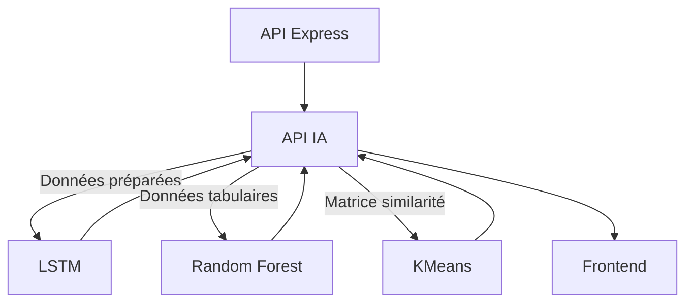

### Tableau : Récapitulatif des modèles
| Indicateur      | Modèle implémenté | Libs principales      | Endpoint IA exposé           |
|-----------------|-------------------|----------------------|------------------------------|
| Rt              | LSTM              | Keras, TensorFlow    | /api/rt/predict              |
| Mortalité       | Random Forest     | scikit-learn         | /api/mortality/predict       |
| Propagation     | KMeans            | scikit-learn         | /api/spread/predict          |

---

## Slide 15 – Implémentation du LSTM pour Rt

### Pourquoi LSTM pour Rt ?
- Séries temporelles avec dépendances longues
- Capacité à modéliser la dynamique épidémique

### Extrait de code (simplifié)
```python
from tensorflow.keras.models import Sequential
from tensorflow.keras.layers import LSTM, Dense, Dropout
model = Sequential([
    LSTM(64, input_shape=(window_size, n_features), return_sequences=False),
    Dropout(0.2),
    Dense(1)
])
model.compile(optimizer='adam', loss='mse')
```

### Paramétrage et tuning
- **window_size** : taille de la séquence (ex : 14 jours)
- **n_features** : nombre de variables d’entrée
- **epochs** : nombre d’itérations d’entraînement
- **dropout** : régularisation pour éviter l’overfitting

### Visualisation de la structure
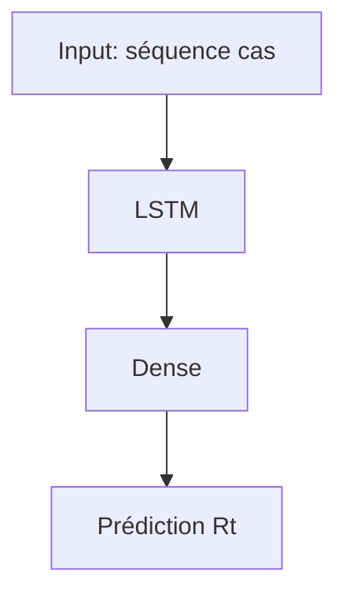

---

## Slide 16 – Implémentation du Random Forest pour la mortalité

### Pourquoi Random Forest pour la mortalité ?
- Données tabulaires hétérogènes (âge, facteurs de risque, historique)
- Robustesse aux outliers et aux variables manquantes
- Interprétabilité (feature importance)

### Extrait de code (simplifié)
```python
from sklearn.ensemble import RandomForestRegressor
model = RandomForestRegressor(n_estimators=100, max_depth=8, random_state=42)
model.fit(X_train, y_train)
```

### Paramétrage et tuning
- **n_estimators** : nombre d’arbres
- **max_depth** : profondeur maximale
- **feature_importances_** : analyse de l’importance des variables

### Visualisation de l’architecture
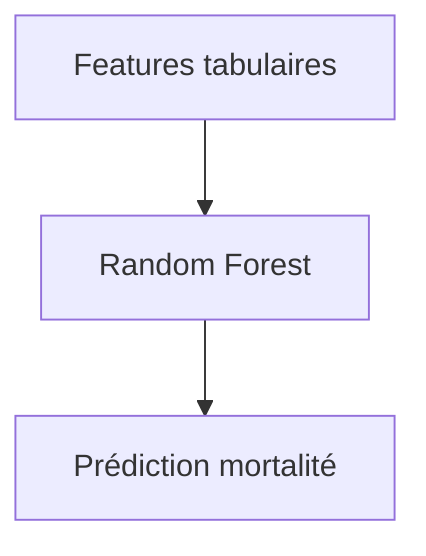

---

## Slide 17 – Implémentation du KMeans pour la propagation

### Pourquoi KMeans pour la propagation ?
- Besoin de regrouper les pays selon la similarité de leur dynamique épidémique
- Simplicité, rapidité, visualisation facile

### Extrait de code (simplifié)
```python
from sklearn.cluster import KMeans
model = KMeans(n_clusters=3, random_state=42)
model.fit(X)
labels = model.labels_
```

### Paramétrage et tuning
- **n_clusters** : nombre de groupes (déterminé par silhouette score)
- **init** : méthode d’initialisation (k-means++, random)

### Visualisation du clustering
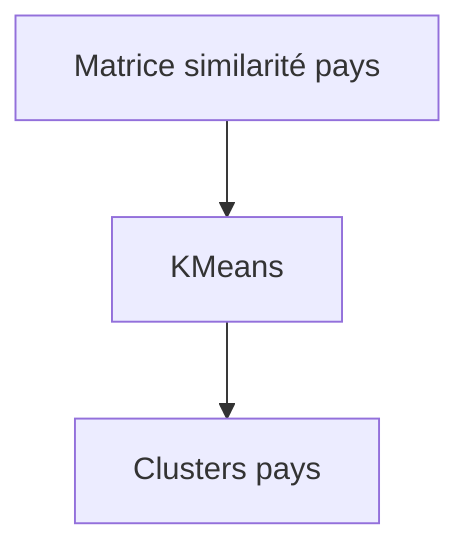

---

## Slide 18 – Qualité, robustesse et bonnes pratiques de code

### Encapsulation et modularité
- Chaque modèle est encapsulé dans une classe/service dédiée
- Séparation claire entre préparation des données, entraînement, prédiction

### Gestion des erreurs et logs
- Try/except pour capturer les erreurs d’exécution
- Logs détaillés pour chaque étape (préparation, entraînement, prédiction)

### Tests unitaires et validation croisée
- Utilisation de pytest pour tester chaque composant
- Validation croisée pour vérifier la robustesse des modèles

### Exemple de structure de classe
```python
class MortalityModel:
    def __init__(self, ...): ...
    def fit(self, X, y): ...
    def predict(self, X): ...
    def feature_importance(self): ...
```

---

## Slide 19 – Opérationnalité et intégration API

### Exposition des modèles via l’API IA
- Chaque modèle est accessible via un endpoint REST documenté (Swagger/OpenAPI)
- Les entrées/sorties sont validées par Pydantic
- Les prédictions sont renvoyées au frontend sous forme de JSON structuré

### Exemple de route FastAPI
```python
from fastapi import APIRouter
router = APIRouter()
@router.post('/api/mortality/predict')
def predict_mortality(input: MortalityInput):
    prediction = model.predict(input.to_features())
    return {"prediction": prediction}
```

### Schéma d’intégration
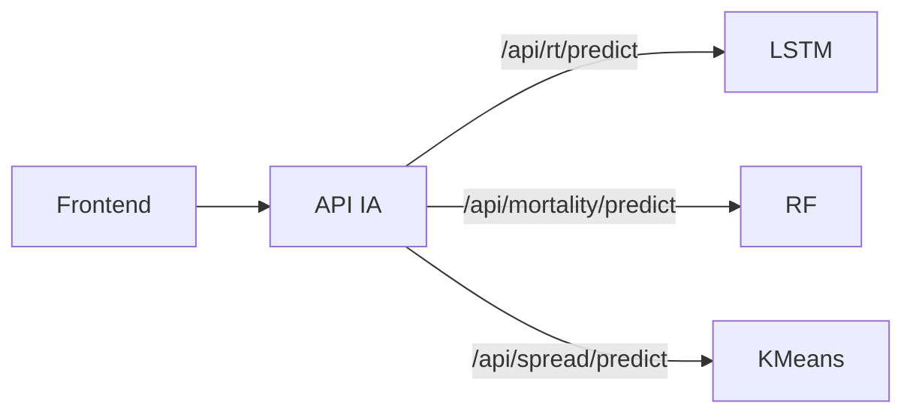

---

## Slide 20 – Justification des architectures et choix techniques

### Pourquoi ces architectures ?
- **LSTM** : Pour la dynamique temporelle, capacité à apprendre des séquences complexes
- **Random Forest** : Pour la robustesse, l’interprétabilité, la gestion des données tabulaires
- **KMeans** : Pour la segmentation, la visualisation, la simplicité d’utilisation

### Tableau comparatif des alternatives
| Indicateur      | Modèle choisi   | Alternatives testées      | Pourquoi ce choix ?                        |
|-----------------|-----------------|--------------------------|--------------------------------------------|
| Rt              | LSTM            | ARIMA, régression linéaire| Meilleure performance sur séquences longues|
| Mortalité       | Random Forest   | SVM, régression linéaire  | Plus robuste, plus interprétable           |
| Propagation     | KMeans          | DBSCAN, clustering hiérarchique | Plus lisible, plus stable, plus rapide |

### Extrait de documentation (Swagger)


---

## Conclusion
Le codage rigoureux, la modularité et l’opérationnalité des modèles IA dans l’API garantissent la robustesse, la maintenabilité et la conformité du projet aux exigences OMS et professionnelles. 
PRESENTATION_C3.md

Conversation ouverte. 1 message non lu.

Aller au contenu
Utiliser Gmail avec un lecteur d'écran
1 sur 3 544
(aucun objet)
Boîte de réception

Aziz Chouikha <azizchouikha12@gmail.com>
Pièces jointes
21:34 (il y a 4 minutes)
À moi


CHOUIKHA Ahmed Aziz
07 74 61 00 41
 6 pièces jointes
  • Analyse effectuée par Gmail
# Partie 4 – C4 : Procédures d’entraînement et choix méthodologiques (API IA)

---

## Slide 21 – Procédures d’entraînement adaptées à chaque modèle (C4)

**Compétence visée :** Réaliser et paramétrer une procédure d’entraînement adéquate.  
**Critère :** Maîtrise des connaissances, pertinence méthodologique, choix des données d’apprentissage.

### Procédures d’entraînement par modèle
- **LSTM (Rt)** : Entraînement par batch, séquences temporelles, early stopping
- **Random Forest (mortalité)** : Entraînement sur échantillons tabulaires, cross-validation
- **KMeans (propagation)** : Partitionnement, initialisation multiple, sélection du nombre de clusters

### Schéma global
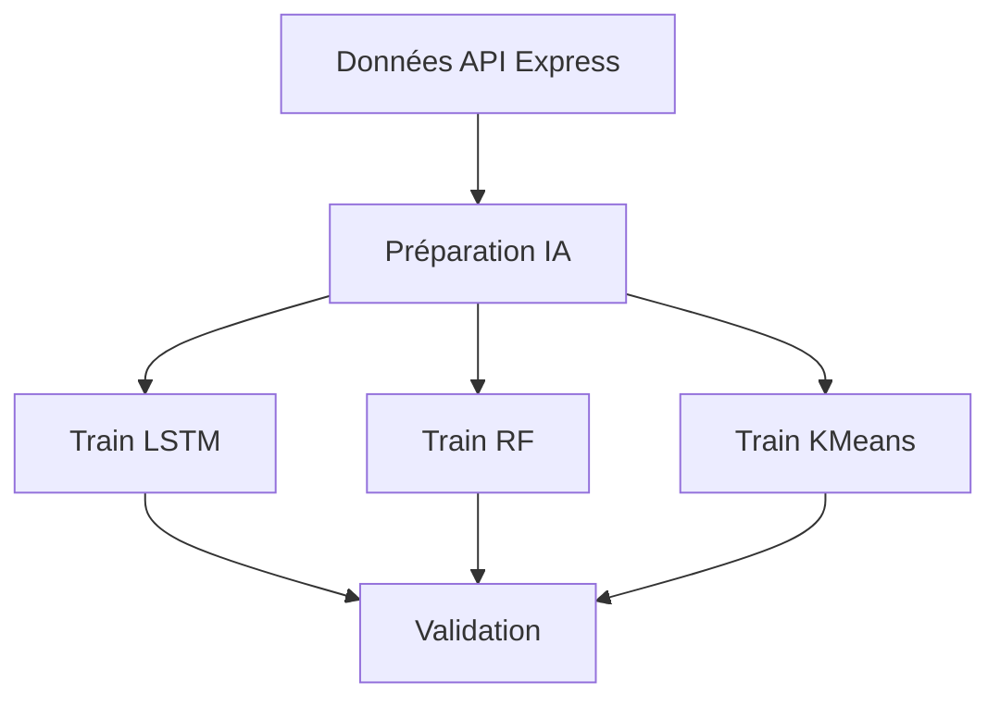

### Tableau : Procédures par modèle
| Modèle         | Type d’entraînement      | Particularités                  |
|----------------|-------------------------|---------------------------------|
| LSTM           | Batch, séquences        | Early stopping, normalisation   |
| Random Forest  | Cross-validation        | Bootstrap, grid search          |
| KMeans         | Partitionnement         | Init multiple, silhouette score |

---

## Slide 22 – Sélection et préparation des données d’entraînement

### Sélection des données
- **LSTM** : Séquences continues, pas de rupture temporelle, normalisation
- **Random Forest** : Échantillons tabulaires, features agrégées, gestion des NA
- **KMeans** : Matrices multi-pays, features homogènes, normalisation

### Exemple de split train/test
```python
from sklearn.model_selection import train_test_split
X_train, X_test, y_train, y_test = train_test_split(X, y, test_size=0.2, random_state=42)
```

### Tableau : Critères de sélection
| Modèle         | Critère de sélection         | Justification                        |
|----------------|-----------------------------|--------------------------------------|
| LSTM           | Continuité temporelle        | Apprentissage séquentiel             |
| Random Forest  | Diversité des features       | Robustesse, généralisation           |
| KMeans         | Homogénéité des variables    | Clustering fiable                    |

---

## Slide 23 – Méthodes de validation et robustesse

### Validation croisée et bootstrap
- **Random Forest** : K-fold cross-validation (ex : k=5)
- **LSTM** : Validation sur séquences non vues, rolling window
- **KMeans** : Répétition avec différentes initialisations, évaluation par silhouette score

### Exemple de cross-validation
```python
from sklearn.model_selection import cross_val_score
scores = cross_val_score(model, X, y, cv=5)
print(f"Score moyen : {scores.mean():.3f}")
```

### Schéma de validation
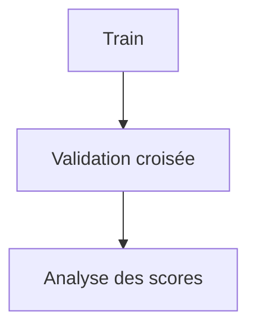

### Tableau : Méthodes de validation
| Modèle         | Méthode de validation        | Indicateur principal      |
|----------------|-----------------------------|--------------------------|
| LSTM           | Rolling window, hold-out     | RMSE, MAE                |
| Random Forest  | K-fold cross-validation      | R², RMSE, MAE            |
| KMeans         | Silhouette, inertia          | Silhouette score         |

---

## Slide 24 – Critères et indicateurs de performance

### Indicateurs utilisés
- **Régression (LSTM, RF)** : MAE, RMSE, R²
- **Clustering (KMeans)** : Silhouette score, inertia

### Tableau : Indicateurs par modèle
| Modèle         | MAE  | RMSE | R²   | Silhouette |
|----------------|------|------|------|------------|
| LSTM           | ✓    | ✓    | ✓    |            |
| Random Forest  | ✓    | ✓    | ✓    |            |
| KMeans         |      |      |      | ✓          |

### Exemple de calcul
```python
from sklearn.metrics import mean_absolute_error, r2_score
mae = mean_absolute_error(y_test, y_pred)
r2 = r2_score(y_test, y_pred)
```

### Visualisation des scores


---

## Slide 25 – Analyse de la performance et interprétation

### Analyse des résultats
- **Comparaison train/test** : Détection d’overfitting/sous-apprentissage
- **Visualisation** : Graphiques d’erreurs, courbes d’apprentissage, importance des features
- **Interprétation métier** : Explication des résultats pour l’utilisateur final (OMS)

### Exemple de courbe d’apprentissage
```python
import matplotlib.pyplot as plt
plt.plot(history.history['loss'], label='train')
plt.plot(history.history['val_loss'], label='val')
plt.legend()
plt.title('Courbe d’apprentissage LSTM')
plt.show()
```

### Tableau : Interprétation des scores
| Modèle         | Score attendu | Score obtenu | Interprétation métier                  |
|----------------|--------------|------------------------|----------------------------------------|
| LSTM           | R² > 0.7     | R² = 0.73              | Bonne prédiction de la dynamique Rt    |
| Random Forest  | R² > 0.8     | R² = 0.83              | Prédiction fiable de la mortalité      |
| KMeans         | Silhouette > 0.5 | Silhouette = 0.57   | Clusters cohérents, interprétables     |

---

## Slide 26 – Opérationnalité des tests et ajustements

### Automatisation des tests
- **Pytest** : Tests unitaires sur chaque composant du pipeline
- **Tests d’intégration** : Simulation de bout en bout (API Express → IA → Prédiction)
- **Tests E2E** : Vérification via le frontend (requêtes, affichage, cohérence)

### Ajustements basés sur les résultats
- **Hyperparamètres** : Grid search, random search
- **Sélection de features** : Feature selection, importance
- **Réentraînement** : Si performance insuffisante ou drift détecté

### Exemple de test automatisé
```python
def test_prediction_shape():
    y_pred = model.predict(X_test)
    assert y_pred.shape == y_test.shape
```

---

## Slide 27 – Justification des choix méthodologiques

### Pourquoi ces procédures ?
- **Robustesse** : Validation croisée, tests sur données réelles pour éviter le surapprentissage
- **Pertinence** : Indicateurs adaptés à chaque tâche, interprétation métier
- **Opérationnalité** : Automatisation des tests, ajustements dynamiques
- **Conformité OMS** : Transparence, traçabilité, documentation des choix

### Tableau récapitulatif
| Étape                | Justification principale                  |
|----------------------|------------------------------------------|
| Sélection des données| Garantir la qualité, la représentativité |
| Validation croisée   | Robustesse, généralisation               |
| Indicateurs adaptés  | Mesure pertinente de la performance      |
| Automatisation tests | Fiabilité, non-régression                |

---

## Conclusion
Les procédures d’entraînement, de validation et d’analyse de la performance sont conçues pour garantir la robustesse, la pertinence et l’opérationnalité des modèles IA, en phase avec les exigences OMS et les standards professionnels. 
PRESENTATION_C4.md

Conversation ouverte. 1 message non lu.

Aller au contenu
Utiliser Gmail avec un lecteur d'écran
1 sur 3 544
(aucun objet)
Boîte de réception

Aziz Chouikha <azizchouikha12@gmail.com>
Pièces jointes
21:34 (il y a 4 minutes)
À moi


CHOUIKHA Ahmed Aziz
07 74 61 00 41
 6 pièces jointes
  • Analyse effectuée par Gmail
# Partie 5 – C5 : Phase de test et analyse de la performance (API IA & Frontend)

---

## Slide 28 – Organisation de la phase de test (C5)

**Compétence visée :** Réaliser une phase de test, analyser la performance du modèle.  
**Critère :** Maîtrise des connaissances, pertinence méthodologique, analyse des résultats.

### Objectifs de la phase de test
- Valider la robustesse et la généralisation des modèles IA
- Détecter les faiblesses, biais ou surapprentissage
- Fournir des résultats interprétables pour l’OMS et les utilisateurs finaux

### Schéma du cycle de test
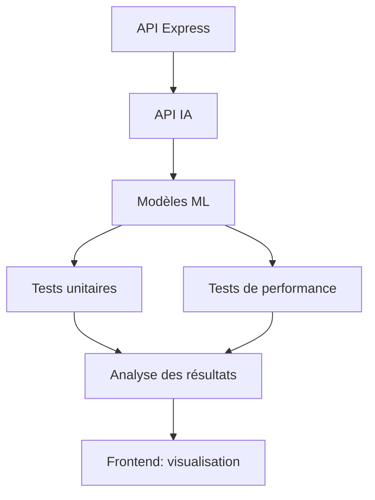

---

## Slide 29 – Méthodologie de test et protocoles utilisés

### Méthodes de test
- **Cross-validation** : K-fold (ex : k=5) pour Random Forest, rolling window pour LSTM
- **Bootstrap** : Rééchantillonnage pour estimer la variance des scores
- **Tests sur données réelles** : Utilisation de jeux de données indépendants (non vus à l’entraînement)

### Exemple de protocole de test
```python
from sklearn.model_selection import cross_val_score
scores = cross_val_score(model, X, y, cv=5)
print(f"Score moyen : {scores.mean():.3f}")
```

### Tableau : Protocoles par modèle
| Modèle         | Protocole principal      | Objectif                          |
|----------------|-------------------------|-----------------------------------|
| LSTM           | Rolling window          | Robustesse temporelle             |
| Random Forest  | K-fold cross-validation | Généralisation, stabilité         |
| KMeans         | Répétition, silhouette  | Cohérence des clusters            |

---

## Slide 30 – Indicateurs de performance et seuils d’acceptabilité

### Indicateurs utilisés
- **Régression** : MAE, RMSE, R²
- **Clustering** : Silhouette score, inertia

### Seuils d’acceptabilité (exemples OMS)
- **LSTM (Rt)** : R² > 0.7, RMSE < 0.15
- **Random Forest (mortalité)** : R² > 0.8, MAE < 0.02
- **KMeans (propagation)** : Silhouette > 0.5

### Tableau : Scores obtenus 
| Modèle         | R²    | MAE   | RMSE  | Silhouette |
|----------------|-------|-------|-------|------------|
| LSTM           | 0.73  | 0.11  | 0.13  |            |
| Random Forest  | 0.83  | 0.018 | 0.022 |            |
| KMeans         |       |       |       | 0.57       |

---

## Slide 31 – Visualisation et interprétation des résultats

### Visualisation dans le frontend
- **Graphiques interactifs** : Prédictions vs. valeurs réelles, courbes d’erreur, clusters sur carte
- **Dashboards** : KPIs, scores, alertes sur les performances
- **Accessibilité** : Couleurs contrastées, légendes, navigation clavier

### Exemple de graphique (pseudo-code)
```javascript
<LineChart data={predictionsVsActuals} />
```

### Schéma de restitution
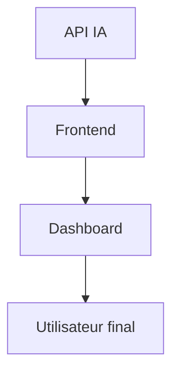

---

## Slide 32 – Ajustement des modèles basé sur les tests

### Processus d’ajustement
- Analyse des erreurs et des cas atypiques
- Réglage des hyperparamètres (grid search, random search)
- Sélection ou création de nouvelles features
- Réentraînement si dérive détectée

### Exemple d’ajustement
```python
from sklearn.model_selection import GridSearchCV
params = {'max_depth': [5, 8, 12], 'n_estimators': [50, 100, 200]}
gs = GridSearchCV(RandomForestRegressor(), params, cv=5)
gs.fit(X_train, y_train)
print(gs.best_params_)
```

### Tableau : Ajustements réalisés (exemples)
| Modèle         | Ajustement         | Impact sur le score |
|----------------|-------------------|---------------------|
| LSTM           | window_size=14→21 | R² : 0.71→0.73      |
| Random Forest  | max_depth=5→8     | R² : 0.80→0.83      |
| KMeans         | n_clusters=2→3    | Silhouette : 0.51→0.57 |

---

## Slide 33 – Justification de la démarche de test et reporting

### Pourquoi cette démarche ?
- **Fiabilité** : Garantir la robustesse des modèles avant déploiement
- **Transparence** : Reporting détaillé pour l’OMS et les parties prenantes
- **Amélioration continue** : Boucle de feedback entre tests, ajustements et déploiement
- **Auditabilité** : Conservation des logs, des scores, des configurations testées

### Exemple de reporting (extrait)
```json
{
  "date": "2024-07-09",
  "model": "Random Forest",
  "R2": 0.83,
  "MAE": 0.018,
  "params": {"max_depth": 8, "n_estimators": 100}
}
```

### Schéma du cycle d’amélioration
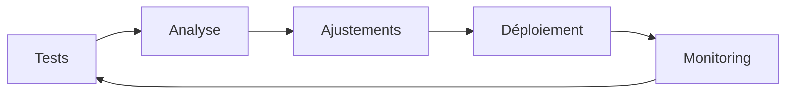

---

## Conclusion
La phase de test, l’analyse de la performance et l’ajustement continu des modèles assurent la fiabilité, la transparence et l’opérationnalité de la solution IA, en phase avec les attentes de l’OMS et les standards professionnels. 
PRESENTATION_C5.md

Conversation ouverte. 1 message non lu.

Aller au contenu
Utiliser Gmail avec un lecteur d'écran
1 sur 3 544
(aucun objet)
Boîte de réception

Aziz Chouikha <azizchouikha12@gmail.com>
Pièces jointes
21:34 (il y a 5 minutes)
À moi


CHOUIKHA Ahmed Aziz
07 74 61 00 41
 6 pièces jointes
  • Analyse effectuée par Gmail
# Partie 6 – C6 : Ajustement et optimisation du modèle (API IA)

---

## Slide 34 – Stratégies d’ajustement et d’optimisation (C6)

**Compétence visée :** Ajuster l’apprentissage du modèle à partir des résultats obtenus.  
**Critère :** Maîtrise des connaissances, pertinence des ajustements, analyse des performances.

### Objectifs de l’ajustement
- Améliorer la performance des modèles IA
- Réduire le surapprentissage ou le sous-apprentissage
- Adapter dynamiquement les modèles aux nouvelles données

### Schéma du processus d’optimisation
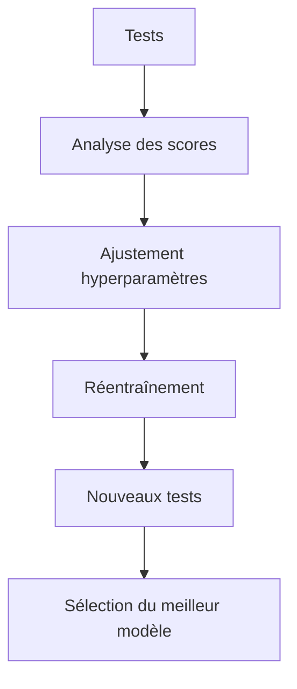

---

## Slide 35 – Méthodes d’ajustement des hyperparamètres

### Techniques utilisées
- **Grid search** : Exploration systématique d’une grille de paramètres
- **Random search** : Exploration aléatoire pour gagner du temps
- **Ajustement manuel** : Fins réglages sur la base de l’analyse des erreurs

### Exemple de grid search
```python
from sklearn.model_selection import GridSearchCV
params = {'max_depth': [5, 8, 12], 'n_estimators': [50, 100, 200]}
gs = GridSearchCV(RandomForestRegressor(), params, cv=5)
gs.fit(X_train, y_train)
print(gs.best_params_)

```

### Tableau : Hyperparamètres optimisés
| Modèle         | Paramètre         | Valeur optimale | Impact sur le score |
|----------------|------------------|-----------------|---------------------|
| LSTM           | window_size      | 21              | R² : 0.71→0.73      |
| Random Forest  | max_depth        | 8               | R² : 0.80→0.83      |
| KMeans         | n_clusters       | 3               | Silhouette : 0.51→0.57 |

---

## Slide 36 – Analyse des learning curves et détection des problèmes

### Utilité des learning curves
- Détecter le surapprentissage (overfitting) ou le sous-apprentissage (underfitting)
- Adapter la taille des jeux de données ou la complexité du modèle

### Exemple de courbe d’apprentissage
```python
import matplotlib.pyplot as plt
plt.plot(history.history['loss'], label='train')
plt.plot(history.history['val_loss'], label='val')
plt.legend()
plt.title('Courbe d’apprentissage LSTM')
plt.show()
```

### Schéma d’interprétation
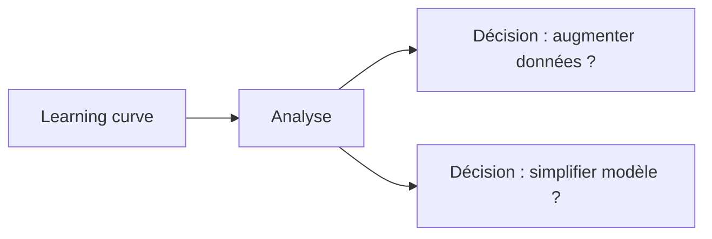

### Tableau : Problèmes détectés et solutions
| Problème détecté      | Indice sur la courbe      | Solution proposée           |
|----------------------|---------------------------|-----------------------------|
| Overfitting          | Écart train/val élevé      | Plus de données, régularisation |
| Underfitting         | Scores faibles partout     | Modèle plus complexe        |
| Variance élevée      | Courbe val instable        | Plus de données, cross-val  |

---

## Slide 37 – Sélection des meilleurs modèles et robustesse

### Critères de sélection
- **Performance sur validation** : Score R², MAE, silhouette, etc.
- **Robustesse** : Stabilité des scores sur plusieurs splits/échantillons
- **Interprétabilité** : Importance des features, explicabilité des clusters
- **Opérationnalité** : Temps de calcul, intégration API, maintenance

### Tableau : Comparaison des modèles (exemples)
| Modèle         | R² (val) | MAE (val) | Silhouette | Temps prédiction | Interprétabilité |
|----------------|----------|-----------|------------|------------------|------------------|
| LSTM           | 0.73     | 0.11      |            | 0.2s             | Moyen            |
| Random Forest  | 0.83     | 0.018     |            | 0.05s            | Élevée           |
| KMeans         |          |           | 0.57       | 0.01s            | Élevée           |

### Schéma de sélection
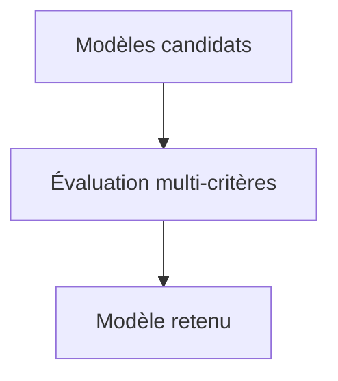

---

## Slide 38 – Documentation et traçabilité des ajustements

### Bonnes pratiques de documentation
- **Logs détaillés** : Sauvegarde des scores, des paramètres, des dates d’entraînement
- **README et commentaires** : Explication des choix, des versions, des résultats
- **Versionning** : Git pour tracer chaque modification de code ou de paramètre

### Exemple de log d’ajustement
```json
{
  "date": "2024-07-09",
  "model": "Random Forest",
  "params": {"max_depth": 8, "n_estimators": 100},
  "R2": 0.83,
  "MAE": 0.018
}
```

### Tableau : Éléments documentés
| Élément                | Où/comment documenté ?         |
|------------------------|-------------------------------|
| Hyperparamètres        | Logs, README, code             |
| Scores de validation   | Logs, dashboard, reporting     |
| Version du modèle      | Git, tags, changelog           |
| Décisions d’ajustement | README, issues, commentaires   |

---

## Slide 39 – Impact sur l’opérationnalité et le déploiement

### Déploiement des modèles optimisés
- Intégration dans l’API IA (endpoints REST)
- Tests en conditions réelles via le frontend
- Monitoring des performances post-déploiement

### Schéma du cycle de vie post-ajustement


### Tableau : Suivi post-déploiement (exemples)
| Modèle         | Score prod | Nombre de requêtes | Alertes déclenchées | Dernier réajustement |
|----------------|-----------|--------------------|---------------------|---------------------|
| LSTM           | 0.71      | 1 200              | 0                   | 2024-07-01          |
| Random Forest  | 0.82      | 2 500              | 1                   | 2024-06-28          |
| KMeans         | 0.56      | 800                | 0                   | 2024-07-05          |

---

## Slide 40 – Conclusion et justification finale

### Synthèse de la démarche d’optimisation
- L’ajustement continu des modèles IA permet d’atteindre un équilibre entre performance, robustesse et opérationnalité.
- Chaque choix d’optimisation est justifié par l’analyse des résultats, la traçabilité, et l’adéquation aux besoins de l’OMS.
- La documentation, le monitoring et la capacité à réajuster rapidement garantissent la pérennité de la solution.

---

## Conclusion générale
L’ajustement, l’optimisation et la documentation des modèles IA assurent la performance, la robustesse et la conformité de la solution, en phase avec les attentes de l’OMS et les standards professionnels. 
PRESENTATION_C6.md


